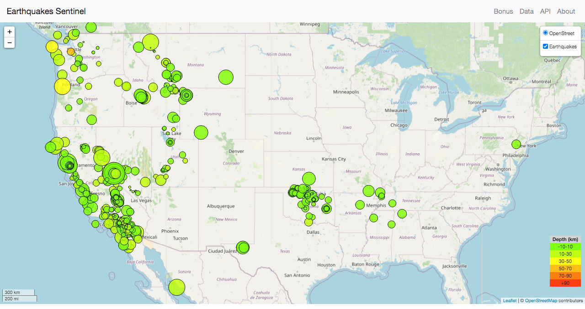
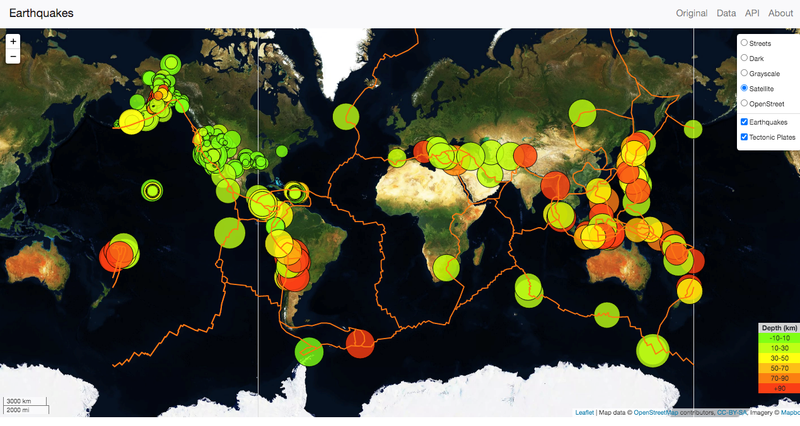
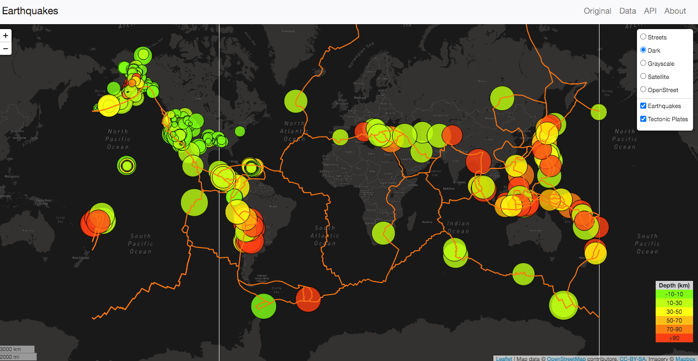
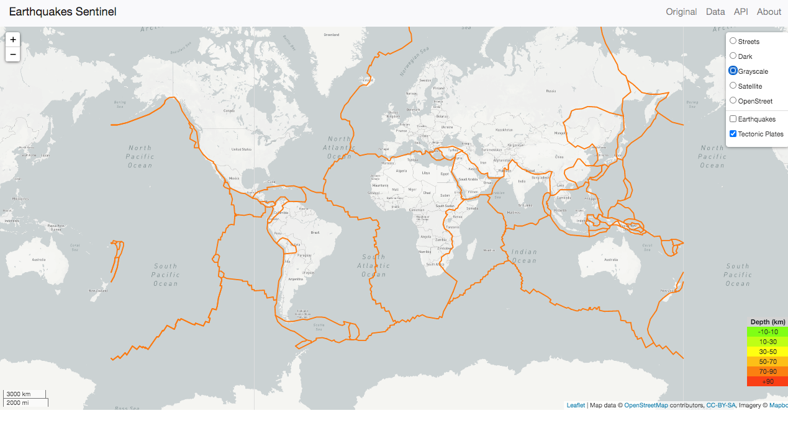
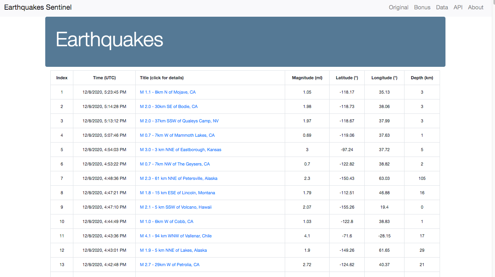
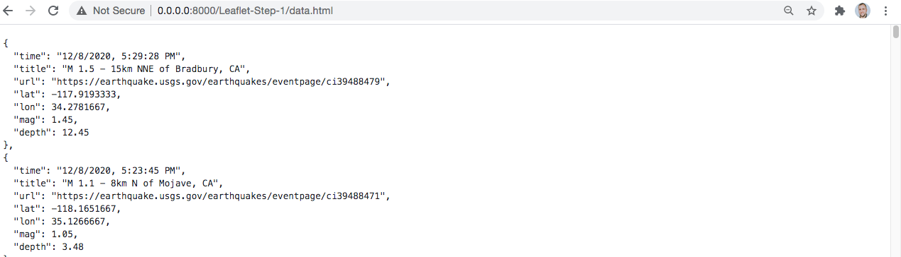

# Visualizing Data with Leaflet

## Rice University Data Analytics and Visualization Boot Camp 2020

This repository contains the following scenario and the final product is available [here*](https://gpivaro.github.io/leaflet-challenge/Leaflet-Step-1/index-step-1.html).
The home page view of the app can be seen below.

## Background

The USGS is responsible for providing scientific data about natural hazards, the health of our ecosystems and environment; and the impacts of climate and land-use change. Their scientists develop new methods and tools to supply timely, relevant, and useful information about the Earth and its processes. The USGS is interested in building a new set of tools that will allow them visualize their earthquake data. They collect a massive amount of data from all over the world each day.

### Level 1: Basic Visualization

Your first task is to visualize an earthquake data set.

1. **Get your data set**

   

   The USGS provides earthquake data in a number of different formats, updated every 5 minutes. Visit the [USGS GeoJSON Feed](http://earthquake.usgs.gov/earthquakes/feed/v1.0/geojson.php) page and pick a data set to visualize. When you click on a data set, for example 'All Earthquakes from the Past 7 Days', you will be given a JSON representation of that data. You will be using the URL of this JSON to pull in the data for our visualization.

   

2. **Import & Visualize the Data**

   Create a map using Leaflet that plots all of the earthquakes from your data set based on their longitude and latitude.

   * The data markers should reflect the magnitude of the earthquake by their size and and depth of the earth quake by color. Earthquakes with higher magnitudes should appear larger and earthquakes with greater depth should appear darker in color.

   * The depth of the earth can be found as the third coordinate for each earthquake.

   * Include popups that provide additional information about the earthquake when a marker is clicked.

   * Create a legend that will provide context for your map data.

   * The visualization can be seen on the map above.

- - -

### Level 2: More Data (Bonus)

Plot a second data set on the map to illustrate the relationship between tectonic plates and seismic activity. Pull in a second data set and visualize it along side your original set of data. Data on tectonic plates can be found at <https://github.com/fraxen/tectonicplates>.

In this step we are going to..

* Plot a second data set on our map.

* Add a number of base maps to choose from as well as separate out our two different data sets into overlays that can be turned on and off independently.

* Add layer controls to our map.

* The visualization can be seen on the map above and in the following maps below.

#### Dark Map

#### Dark Map With Earthquakes

#### Dark Map With Tectonic Plates

#### Gray Map With Tectonic Plates

#### Street Map

- - -

### Additional: Data Table and API

Create a data table where the user can access all the data collected from the 'All Earthquakes from the Past 7 Days' and display it as a table. The user can access more details about each earthquake by clicking on the link that redirects the user to the USGS page for that specific event. The final data table is available [here](https://gpivaro.github.io/leaflet-challenge/Leaflet-Step-1/table-data.html).

Allow the user to access the JSON version of the data used to plot the earthquakes by creating an API where all the data is available.
The API is available [here](https://gpivaro.github.io/leaflet-challenge/Leaflet-Step-1/data.html).

**Disclaimer:** The part I of this application is using OpenStreetMap and was deployed on Github pages. By using the OpenStreetMap no API key was necessary. The bonus part is using the Mapbox API and requires API key. Therefore, the bonus part is not available on Github pages.
